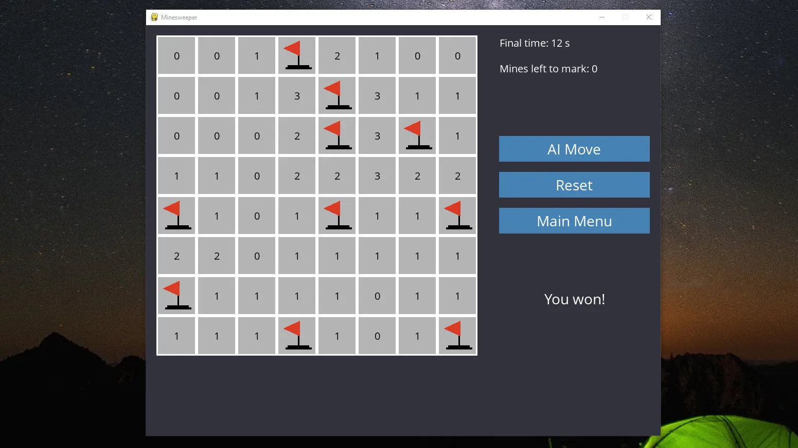

# Minesweeper

A classic Minesweeper puzzle game implemented in Python with a Pygame graphical interface, featuring multiple difficulty levels and an AI assistant that can help solve the board.



## Features

- **Graphical Interface**: Utilizes Pygame to render the game board, cells, and interface elements for a user-friendly experience. The interface includes buttons and displays (e.g. timer, mine counter) similar to the classic game.
- **Multiple Difficulty Levels**: Offers Easy, Medium, and Hard modes:
  - *Easy*: 8×8 grid with 10 mines
  - *Medium*: 16×16 grid with 40 mines
  - *Hard*: 24×24 grid with 99 mines
- **AI Assistant**: An optional Minesweeper AI can make moves for you. The AI uses a knowledge base of logical Sentences about the board to deduce safe cells or possible mines. It will automatically mark cells as safe or mined when it’s certain, and only resort to random moves when no logical safe move is available. You can press the "AI Move" button during the game to let the AI play the next move.
- **Customizable Game Settings**: The board dimensions and mine count are adjustable. You can easily modify the difficulty presets or create new ones by changing the parameters in the code (e.g., in `runner.py`'s `difficulties` dictionary).

## Installation

1. **Install Python 3**: Make sure Python 3.x is installed on your system.
2. **Clone the repository**:
```
git clone https://github.com/Leminiscent/minesweeper.git
cd minesweeper
```
3. **Install Dependencies**: Use pip to install the required library:
```
pip install -r requirements.txt
```

## Usage

Once installed, you can launch the game as follows:
- **Start the game**: Run the `runner.py` script using Python:
```
python runner.py
```
A window should open with the Minesweeper game interface. You will first see a main menu with instructions and difficulty options.
- **Choose a difficulty**: Select Easy, Medium, or Hard from the main menu to start a new game at that difficulty. The board will be generated with the corresponding size and number of mines.
- **Gameplay controls**:
  - **Left-click** on a cell to reveal it. If it contains a mine, the game is lost; otherwise it will show the number of adjacent mines (or be blank if no adjacent mines).
  - **Right-click** on a cell to mark it as a mine (place a flag). This helps keep track of suspected mines. Right-click again to unflag if needed.
  - **AI Move button**: Click the "AI Move" button at any time to let the AI assistant make a move for you. The AI will either safely reveal a cell it knows is safe or, if no certain knowledge, make a random move. This can be used to get hints or even to watch the AI play the game.
  - **Reset / Menu**: You can reset the current game or return to the main menu at any point (for example, to change difficulty or start a new round).
- **Winning and losing**: The game ends when you either reveal a mine (loss) or successfully flag all mines and reveal all other cells (win). A win is detected when all mines have been correctly flagged or uncovered safely.

## Project Structure

The repository is organized into a few key files and directories:
- **`minesweeper.py`**: Contains the core game logic. It defines the `Minesweeper` class for the game board and mine generation, as well as the `MinesweeperAI` class that implements the AI logic and knowledge base. The `Minesweeper` class handles board setup, mine placement, and basic utility functions (e.g. checking for a mine, counting nearby mines). The `MinesweeperAI` class manages knowledge (through Sentence objects) and methods to mark cells as safe or mines, to update knowledge, and to decide on moves (safe move vs random move).
- **`runner.py`**: Implements the Pygame event loop and user interface. This script initializes the game window, handles user input, draws the board and UI elements, and integrates the AI moves on button press. It uses the classes from `minesweeper.py` to reset or update the game state. The `runner.py` script is the main entry point to start the game.
